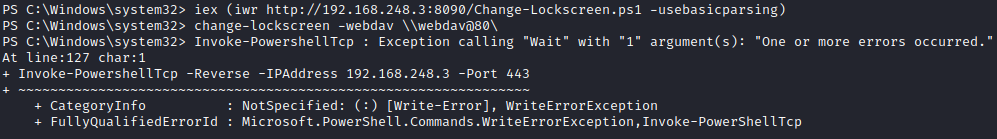

# SQL Server

### Create a SQL User

1. Login to `DC03` as the `Administrator` user with password `Welcome01!`.
2. Open the "Server Manager" and open the "Active Directory Users and Computers" tool in the tool section.

.png>)

3\. Expand the "secure.local" directory, right click on "User" and select "New" and "User".

4\. Create a user with the name `sa_sql`.

 (1) (1) (1).png>)

5\. Set the password "`Iloveyou2`" and create the user.&#x20;

6\. Open the tab "Account" and select "Password never expires" under "Account options".

.png>)

### Installing SQL Server

1. Login to `DATA01` as the `Administrator` user with password `Welcome01!`.
2. Download SQL Server 2019 from [Microsoft Evaluation Center](https://www.microsoft.com/en-us/evalcenter/evaluate-sql-server-2019).

 (1) (1).png>)

3\. When smartscreen comes up select "Run".

 (1) (1) (1).png>)


The SQL Server Installation may require internet access, temporally add a second adapter in the machine settings and select the NAT network. The machine should have internet access. (ps our first adapter is different since our lab runs on a ESXI host).

 (1) (1) (1) (1) (1).png>)


4\. On "Select an installation type" select "Basic":

.png>)

5\. Accept the License Terms and click "Install".

 (1) (1).png>)

6\. Once the installation is finished, click on "Customize".

 (1).png>)

8\. Click next till the "License Terms" step.

7\. Check "Use Microsoft Update to check for updates" and click next till the step "License Terms" and accept them:

 (1) (1).png>)

8\. At the step "Feature Selection" choose the following options:

* Database ENgine Services
* SQL Server Replication
* Client Tools Connectivity
* Client Tools SDK

 (1).png>)

9\. Click Next and fill in the Instance name `data`.

 (1) (1).png>)

10\. Change the "Startup Type" for the "SQL Server Agent" to "Automatic" and make sure all three are set to "Automatic". Then change the account name for "SQL Server agent" and "SQL Server Database Engine" to `sa_sql` and fill in the password `Iloveyou2`.

 (1).png>)

11\. At the next step select "Windows authentication mode". Then select "Add" at the "Specify SQL Server administrators" and add `secure\administrator` then click "Next".&#x20;

 (1).png>)

12\. Click "Install" and wait for the installation to finish.

13\. Open the "SQL Configuration Manager".

 (1) (1) (1).png>)

14\. Expand "SQL Server Network Configuration" and select "Protocols for DATA". Double click on "TCP/IP" and select the "IP Addresses" tab. Fill in `1433` for "TCP Port".

 (1).png>)

15\. Scroll to the bottom and also configure IPAll:

 (1).png>)

15\. Then click "Apply".

 (1) (1) (1).png>)

16\. Open "SQL Server services" and right click on "SQL Server (DATA)" and click "Restart".

 (1) (1).png>)

17\. Do the same for "SQL Server Agent".

18\. Download and Install [SQL Server Mangement Studio](https://docs.microsoft.com/en-us/sql/ssms/download-sql-server-management-studio-ssms?redirectedfrom=MSDN\&view=sql-server-ver15). Just Click "Install" and reboot the system.

### Configuring Windows Firewall for SQL Server

1. Search for "Windows Defender Firewall with Advanced Security" and select "Windows Defender Firewall with Advanced Security".

 (1) (1).png>)

2\. Right click on "Inbound Rules" and select "New rule".

3\. Select "Port" and click "Next".



4\. Make sure "TCP" is selected and fill in port `1433` and click "Next":

 (1) (1).png>)

5\. Click next at the step "Profile". Fill in the name "Allow TCP 1433 MSSQL Server for all" and click "Finish".

 (1) (1) (1).png>)

### Testing connectivity

1\. Open the Kali machine and run a quick Nmap to check if the port is open:

```
sudo nmap -p 1433 10.0.0.101 -Pn -n
Starting Nmap 7.92 ( https://nmap.org ) at 2022-03-14 18:14 CET
Nmap scan report for 10.0.0.101
Host is up (0.0100s latency).

PORT     STATE SERVICE
1433/tcp open  ms-sql-s

Nmap done: 1 IP address (1 host up) scanned in 0.13 seconds
                                                             
```
