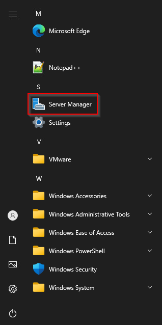

# Creating Domain Controller - DC03

## General machine info

* Machine Name: `DC03`
* IP Adress: `10.0.0.100`
* Subnetmask: `255.255.255.0`
* Gateway: `10.0.0.1`
* DNS: `10.0.0.100`
* Role: Domain Services
* Domain: `secure.local`

## Installation after sysprep

1. Startup the machine.
2. When asked if you copied the Virtual Machine, select "I Copied It".

 (1) (1).png>)

3\. Choose the correct settings for your lab, in our example we choose for the region "Netherlands", for app language we choose "English (United States)" and for keyboard layout "United States-International".

4\. Accept the 'License terms'.

5\. When asked to "Customize Settings" and set a password for the `Administrator` user, set the same password as before. Which was `Welcome01!`.

6\. Press CTRL + ALT + DEL and login with the user and password we just set.

## Renaming and setting a static IP

1. &#x20;Open File Explorer --> right click "This PC" --> Properties.

 (1) (1).png>)

2\.  Click on "Rename this PC".

 (1).png>)

3\. Fill in `DC03` and click "Next".

4\. When asked to restart, click on "Restart Now".

5\. Login again and rightclick in the Taskbar on the Networking Icon and select "Open Network & Internet Settings".

.png>)

6\. Click on "Change adapter options".

 (1).png>)

7\. Right click the Ethernet adapter and select "Properties".

 (1) (1) (1).png>)

8\. Select "Internet Protocol Version 4 (TCP/IPv4) and click "Properties".

.png>)

9\. Copy the following settings:

 (1).png>)

10\. Click on "OK" and close all the Windows.

## Creating a new forest

### Installing Domain Services

1\. Click on start and open the "Server Manager".

2\. On the right top click on "Manage" and "Add Roles and Features".

.png>)

3\. Check the "Skip this page by default" box and click "Next" three times (For the steps "Before You Begin", "Installation Type" and "Server Selection".

4\. At the step "Server Roles" select "Active Directory Domain Services".

5\. After we have selected "Active Directory Domain Services" a new window will pop-up. Within this window we click on "Add Features".

6\. After "Active Directory Domain Services" is selected we click on "Next". We also click "Next" at the "Features" and "AD DS" steps.

7\. At the "Confirmation" step click "Install". This can take some minutes.

8\. When the installation finishes close the window.

### Promoting to Domain Controller

1\. In the server manager click on the flag and click on "Promote this server to a domain controller"

 (1) (1) (1) (1) (1) (1) (1) (1).png>)

2\. Select "Add a new forest" and fill in the domain name `secure.local`.

3\. At the step "Domain Controller Options" set a DSRM Password. For this domain we will choose `SecureRecoveryKey2022` as password.

 (1) (1) (1) (1) (1) (1).png>)

4\. For the steps "DNS Options", "Additional Options", "Paths" and "Review Options" click Next.

5\. At the step "Prerequisites Check" click "Install".

 (1) (1).png>)

6\. The machine should automatically restart, if not manually restart the machine.

7\. Login with the `Administrator:Welcome01!` credentials.

### Creating DNS records

1. Login to `DC001` as the `Administrator` user with password `Welcome01!`.
2. Open the "Server Manager", click on "Tools" and open the "DNS" tool.

 (1).png>)

3\. In the DNS Server expand "DC01" and right click on "Conditional Forwarders" and click "new".

4\. Add the DNS Domain `secure.local` with the IP `10.0.0.100` and click "OK".&#x20;

 (1) (1) (1) (1) (1) (1).png>)


If you see a cross don't worry. I takes some time to validate. You can check the properties later to check if it is validated.


5\. Do the same on `DC03` but then for `bank.local` with the IP `10.0.0.2`.

 (1) (1) (1) (1) (1) (1).png>)

### Creating trust to bank.local

1. Open the "Server Manager", click on "Tools" and then "Active Directory Domain and Trusts".

 (1) (1) (1) (1).png>)

2\. Right click the domain object "Secure.local" and click on "Properties".

 (1) (1).png>)

3\. Click on the tab "Trust", then click "New Trust" and then click "Next".

4\. On the "Trust Name" page, type the NetBIOS name `bank.local` and then click "Next".

 (1) (1) (1) (1) (1).png>)

5\. On the "Trust Type" page, select "External trust" and click "Next".

 (1) (1) (1) (1) (1) (1) (1).png>)

6\. On the "Direction of trust" page select "Two-Way" and click "Next".

7\. On the "Sides of Trust" page select "Both this domain and the specified Domain" and click "Next".

.png>)

8\. Fill in the the credentials Administrator and password Welcome01.

 (1).png>)

9\. Select "Domain-wide authentication" for this trust and click "Next".&#x20;

10\. Select "Domain-wide authentication" for this trust and click "Next" till the page "Confirm Outgoing Trust".

11\. On the page "Confirm Outgoing Trust" select "Yes, confirm the outgoing trust".

12\. On the page "Confirm Outgoing Trust" select "Yes, confirm the outgoing trust".

13\. Click "Finish"

14\. Close the Windows.

### Enable RDP

1. Open the Server Manager and click in the left menu on "Local Server".
2. Click on "Disabled" in the "Remote Desktop" section

 (1) (1) (1) (1).png>)

3\. Then select "Allow remote connections to this computer" in the "Remote Desktop" section and click "Apply" and "Ok".

 (1) (1) (1) (1) (1).png>)

Remote Desktop is enabled.
